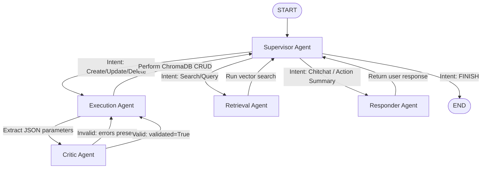

# Project TaskMaker AI

Project TaskMaker AI is an intelligent, web-based, multi-agent AI secretary. It enables users to schedule, manage, and query tasks via a natural language chat interface and an interactive visual dashboard.

The system is built on **LangGraph** for multi-agent coordination, uses any OpenAI-compatible API endpoint for task execution, and stores semantic memories using **ChromaDB**. The frontend is built on **Streamlit**.

---

## 1. System Pipeline Architecture

The multi-agent coordinator determines how to process user requests by routing messages through a state-graph:



### Coordinator Agents:
*   **Supervisor Agent**: Analyzes message history and routes the query to the correct specialized agent.
*   **Execution Agent**: Extracts structured parameters from natural language prompts, creates payload targets, and runs database tools.
*   **Critic Agent**: Performs validation checks on execution payloads against a strict schema before DB mutations are committed.
*   **Retrieval Agent**: Searches ChromaDB using vector similarity to retrieve relevant tasks.
*   **Responder Agent**: Summarizes the operations performed or handles general chitchat.

---

## 2. Setup and Requirements

### 2.1 Dependencies
Ensure you have the virtual environment activated:
```bash
source .venv/bin/activate
```
Dependencies include:
*   `streamlit` (Frontend web interface)
*   `langgraph` & `langchain-openai` (Agent orchestration)
*   `chromadb` (Semantic vector store)
*   `pandas` (Tabular data rendering)
*   `httpx` (API health checks)

### 2.2 Global LLM Configuration (`config.json`)
The project is LLM-agnostic. All endpoints and models are managed globally in `config.json` in the root workspace directory. Copy `config.json.example` to `config.json` and adjust the values to match your local or remote inference server:
```json
{
  "llm_base_url": "http://localhost:9999/v1",
  "llm_model": "your-openai-compatible-model-name",
  "llm_api_key": "your-api-key-if-required"
}
```

---

## 3. How to Run the Web Dashboard

To launch the Streamlit web dashboard on port `8000`:
```bash
streamlit run app.py --server.port 8000
```
Then open `http://localhost:8000` in your web browser.

### Interface Walkthrough:
1.  **Chat Assistant Tab**: Chat with the agent, schedule bulk tasks, create repeating tasks (e.g. "daily running for the next week"), or delete items. The collapsible **AI Orchestration Steps** log is visible by default so you can inspect supervisor routing, critic validations, and tool executions.
2.  **Tasks Dashboard Tab**: A real-time list view of your database organized as a monthly calendar grid. Each cell displays the day's tasks as expanders. Clicking a task opens inline details and editing controls (Save, Delete) to update or remove tasks directly without typing commands.

